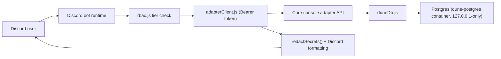

# Design and Architecture

**Last verified against commit:** (set at commit time below) — see `scripts/check-architecture-doc-drift.js` for the mechanical check that keeps this current.

## Overview

The Discord bot lives in its own repository so the Dune console remains the
safety boundary. It uses Discord slash commands to ask the console adapter
for data and, for a bounded set of operational actions, to perform writes.
**"Version 1 is read-only" (this doc's own prior claim) is no longer true** —
see Write Capabilities below. The bot does not need Docker socket access,
database credentials, shell access, or mounted game files. It only needs the
bearer-token protected adapter API.

## Known Past Confusion — read this first

**This exact question has recurred across multiple sessions: "does Mentat
connect directly to the game's Postgres database?" The answer is, and has
always architecturally been, NO.**

Verified directly, this session: `package.json`'s `dependencies` are
`better-sqlite3`, `discord.js`, `express`, `qrcode`, `shamirs-secret-sharing`
— no `pg`, no `node-postgres`, no Postgres driver of any kind. Mentat's own
local database (`src/database.js`, SQLite via `better-sqlite3`) stores only
bot/Discord state — `guilds`, `guild_roles`, `guild_settings`, `key_versions`,
`secret_keys`, `secret_access_log`, `oauth_sessions`, `player_links`,
`guild_member_activity`, `bot_stats`, `stats_snapshot`,
`guild_stats_snapshot`. It never stores game data.

The real, only path to the game database is: **Mentat → `adapterClient.js`
(HTTP, `Authorization: Bearer <token>`, see `adapterClient.js:405`) → Core's
console adapter API (`dune-awakening-selfhost-docker`'s `routes.js`) →
`duneDb.js` → Postgres.** Postgres itself runs in the `dune-postgres`
container on dune-prod, bound to `127.0.0.1`-only — structurally unreachable
from Mentat's host (the separate acp-bot VM) even if someone wanted a direct
connection. There is exactly one path, not a choice between paths: everything
new must extend the adapter route pattern below, never invent a direct DB
connection.

## Runtime Flow

1. A Discord user runs a slash command.
2. The bot checks RBAC (`src/rbac.js`) — see Role Tiers below.
3. The bot sends a bearer-token authenticated request to the configured
   console adapter endpoint via `adapterClient.js`.
4. The console adapter (`dune-awakening-selfhost-docker`) queries Postgres
   via `duneDb.js` and returns JSON.
5. The bot redacts credential-shaped keys (`src/format.js`'s
   `redactSecrets()`, used in `commands.js` and `announcements.js`), bounds
   the Discord message length, and posts the response.



## Boundaries

- This repository owns command registration, Discord runtime, formatting,
  deployment docs, and tests.
- Console repository (`dune-awakening-selfhost-docker`) owns the adapter API
  and all decisions about how data is gathered/written from Postgres.
- **The bot never connects to the Dune database directly, never holds a
  Postgres credential of any kind, and never executes raw SQL.** Every game
  data need — read or write — goes through the adapter API.

## Role Tiers (`src/rbac.js`)

Single source of truth, unified with Core's own tier model 2026-09-05
(issue #238, matching `rfc-console-auth.md` sec 2.1.1):

```
observer < moderator < admin < owner
```

- These are the **internal tier names** (`TIERS`/`TIER_RANK` in `rbac.js`,
  and the `guild_roles.role_type` CHECK-constrained DB values).
- **User-facing display labels differ**: `observer` is shown to users as
  **"Player"** (`ROLE_TYPE_LABELS` in `rbac.js`; confirmed live in
  `commands.js` lines 294/317 — "Player/Moderator/Admin/Owner"). `moderator`,
  `admin`, `owner` display under their own names unchanged. This resolves a
  discrepancy tracked in `mentat`#359: an earlier automated survey reported
  `public < observer < moderator < admin`, which is wrong on two counts —
  there is no `public` tier, and it omitted `owner` entirely. The correct
  model is the four-tier one above, with `observer`/"Player" as the bottom
  rung, not a separate fifth thing.
- **`owner` can never be reached via a Discord role mapping — architecturally,
  permanently, by design** (`rbac.js`'s `resolveActorAuthTier`,
  `isGuildOwner`). It is derived *exclusively* from live Discord guild
  ownership. Legacy `guild_roles` rows with `role_type="owner"` from
  pre-unification installs still exist in some databases but are explicitly
  filtered out and never consulted. **Any Discord role you create — no
  matter what you name it or how it's configured — can reach at most
  `admin`.** Owner-tier actions (see Write Capabilities) remain permanently
  restricted to whichever single Discord account literally owns the guild.
- Role→tier mapping is DB-backed (`guild_roles` table: `guild_id, role_type,
  role_id`), multi-tenant by design — one Mentat process serves multiple
  Discord guilds/operators, every table scoped by `guild_id`.

## Read Capabilities

Real, live routes (`adapterClient.js`'s `LIVE_ROUTES`, extensively
reconciliation-commented in that file with dates and PR references — read
that comment history before assuming a route's status): `health`, `status`,
`readiness`, `services`, `population`, `version`, `servers`, `ports`, `db`,
`logs`, `map-state`, `ops-activity`, `ops-combat`, `ops-resources`,
`ops-economy`, `ops-inventory`, `ops-soc`, `ops-prometheus`, `players-link`,
`players-link-verify`, `players-unlink`, `players-me`, `players-inventory`,
`players-inventory-search`, `players-storage`, `players-find`,
`guild-storage`, `guild-find`, `backups`, `announcements`, `maintenance`.

## Write Capabilities

**The single source of truth for real write commands is
`src/writeActions.js`'s `WRITE_ACTIONS` table** — both Discord command
registration (`commands.js`) and dispatch (`writeHandler.js`) read from it.
`src/writeCommands.js`, the old predecessor list, has been **deleted**
(mentat#400) — it had zero real importers left anywhere in `src/`/`test/`
once `writeActions.js`/`writeHandler.js` became the single source of
truth, and `scripts/check-architecture-doc-drift.js` (mentat#401) now
reads those two files directly instead of the old one.

**Player-facing write commands DO exist as of the
write-command-reconciliation branch** (`docs/design/write-command-reconciliation-l1-design-2026-09-22.md`)
— this section's own prior claim that "no player-facing write (kick, ban,
grant item) exists today" and that "player-facing write capability ... does
not exist in Mentat today" is false and has been corrected here. Every one
is tier-gated, and the gate is enforced by `canWrite()` before any Core call:

| Group | Commands | Tier |
|---|---|---|
| `player` | warn | **moderator** (the only moderator-tier write action) |
| `player` | kick, ban, unban, fill-water | admin |
| `player` | give-item, clear-backpack | **owner** |
| `base` | refill-generators, refill-water | admin |
| `server` | start, restart-service | admin |
| `server` | restart, stop (single owner-tier confirmation, like every other write action — the second, different-admin confirmation `stop` was originally designed with was removed in mentat#404, since owner tier is exactly one Discord account per guild and no second owner-tier admin can exist) | **owner** |
| `map` | spawn, despawn, respawn, teleport | admin |
| `carepackage` | grant, enable, disable, scan | admin |
| `carepackage` | grant-all, history-clear | **owner** |
| `guild` | add, remove | admin |
| `operations` | create-backup, trigger-update | **owner** |
| `bot` | self-update | `host-operator` sentinel — never `canWrite()`; a dedicated bot-host-operator identity check (`config.discord.botOperatorUserId`), because self-update restarts the one shared process serving every tenant |

Flow: `writeHandler.js` → `writeActions.js` → `adapterClient.writePreview()`
→ button confirmation (`writeConfirmation.js`) → `adapterClient.writeExecute()`.
A separate `broadcast` route is also live (admin announcements to a channel),
gated by `DUNE_DISCORD_WRITES_ENABLED`, as is every write command above.

Nine legacy scaffold entries (`LEGACY_WRITE_STUBS` in `writeHandler.js`,
under `/dune write <name>` — maintenance-note, maintenance-window,
alert-channel, alert-threshold, digest-schedule, post-schedule, add-channel,
remove-channel, cache) still return the "awaiting upstream contract"
response and never reach Core. `src/writeCommands.js`, the original
hand-written registry these names came from, has been deleted — it had no
real caller left once `writeActions.js`/`writeHandler.js` became the single
source of truth (mentat#400). The other three entries of that old
list — backup, restart, update — were promoted to real actions in the
table above (`operations create-backup`, `server restart-service`,
`operations trigger-update`).

The broader read/write architecture effort tracked in
`dune-awakening-selfhost-docker`'s `docs/rw-architecture.md` is a separate,
Core-side design; re-check that file's own tracking section directly rather
than trusting any summary here.

## Core-side data availability (checked 2026-09, re-verify before relying on this list)

Confirmed via direct grep of `duneDb.js`: real query logic already exists
for `specialization_tracks`, `player_state.online_status`, `guilds.
guild_faction`, `landsraad_decree*`, and `dune_exchange_orders`. **Zero
matches for `item_audit_log` or `cheater_tracking` anywhere in `duneDb.js`**
— any feature needing those tables requires new Core-side work (a new
`duneDb.js` function + adapter route) before Mentat has anything to call via
`adapterClient`. Confirmed again this session (0 matches, both tables).

## Security Controls

- Bearer-token authentication to the console adapter (`adapterClient.js:405`).
- RBAC tiers as above, fail-closed (`tierAtLeast` returns false for any
  null/unrecognized tier).
- Credential, PII, and game identity fields redacted before Discord output
  (`src/format.js`'s `redactSecrets()`).
- No Docker socket, no DB credentials, no raw command execution, no game-file
  mounts, no direct Postgres connection of any kind.

## Unit Testing

```bash
npm test
```
